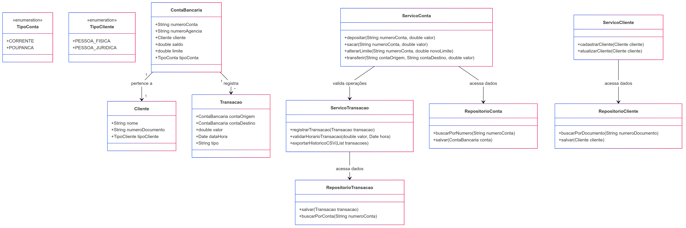
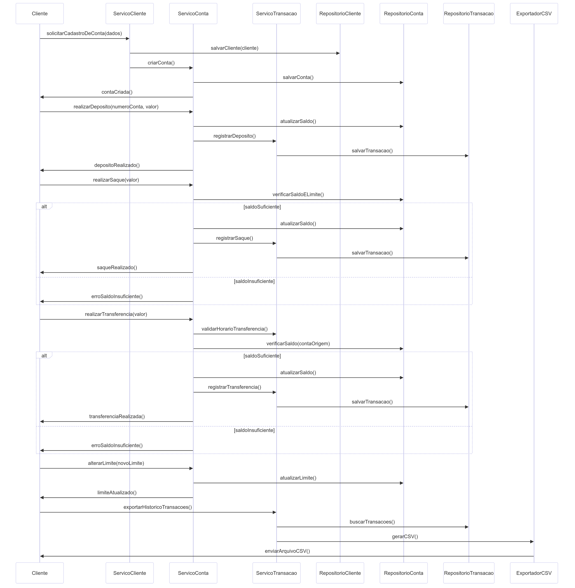

# Sistema Bancário

Este é um projeto em **Java** baseado na **Clean Architecture**, com foco em baixo acoplamento e alta coesão. 
O objetivo é garantir que o núcleo da aplicação seja independente, facilitando futuras evoluções.

## Funcionalidades

- Cadastro de conta bancária (Pessoa Física e Jurídica)
- Depósito e saque
- Alteração de limite
- Transferências entre contas (com limitação de horário)
- Exportação de histórico de transações (CSV)

## Arquitetura

Este projeto segue os princípios da **Clean Architecture**, separando as responsabilidades em camadas distintas:

- **Entidades:** Representam as regras de negócio principais e os dados essenciais, como `Conta`, `Cliente` e `Transação`. Essas classes são independentes de frameworks e não contêm dependências externas.

- **Serviços:** Contêm a lógica de aplicação, coordenando as operações de negócios, como depósitos, saques e transferências. São responsáveis por garantir que as regras de negócio sejam aplicadas corretamente.

- **Repositórios:** Definem contratos para acesso a dados. A implementação real pode ser feita em diferentes bancos de dados ou até mesmo usando arquivos, sem impactar as regras de negócio.

- **Camada Externa:** Responsável por interações com o usuário, banco de dados, ou exportação de dados (por exemplo, gerar um arquivo CSV).

Essa organização permite que mudanças em uma camada não afetem diretamente as outras, mantendo o projeto flexível e de fácil manutenção.

## Menu Interativo

A aplicação possui um **menu interativo** que permite ao usuário acessar as funcionalidades diretamente pelo terminal. O menu exibe opções como:
- Criar uma nova conta
- Realizar um depósito
- Realizar um saque
- Alterar o limite da conta
- Fazer uma transferência
- Exportar histórico de transações

O usuário poderá navegar facilmente pelas opções, inserindo o número correspondente à operação desejada.

## Como executar

1. Clone o repositório:
   ```bash
   https://github.com/michellekenia/sistema-bancario

2. Abra o projeto no seu editor de código (IntelliJ, VS Code, etc.) e execute a classe principal.
   <br><br>
3. Siga as instruções do menu interativo.

## Exportação do Histórico de Transações

### Como Alterar o Caminho do Arquivo de Exportação

Por padrão, o caminho para exportação do arquivo CSV é configurado dentro do código. Para alterar esse caminho e salvar o arquivo em outro local, siga os passos abaixo:

1. **Abra o arquivo da classe `Menu`**. O caminho do arquivo é especificado no método `exportarHistorico`. O código que define o caminho é semelhante a este:

   ```java
   String caminhoArquivo = "/home/mih/IdeaProjects/sistema-bancario/src/relatorios/historico_transacoes.csv";

2. **Modifique o caminho do arquivo**. Altere o caminho para o local onde clonou o repositório do projeto, para continuar usando a pasta `relatorios` localizada dentro do projeto:

   ```java
   String caminhoArquivo = "/seu-diretorio/sistema-bancario/src/relatorios/historico_transacoes.csv";

3. **Se desejar, altere o local completamente**. Você pode escolher o local que desejar para salvar o histórico de transações, independente do local do projeto:

   ```java
   String caminhoArquivo = "/home/usuario/documentos/historico";

## Diagrama de Classes


## Diagrama de Sequência


 
## Contato
Em caso de dúvidas, entre em contato: keniamsoaress@gmail.com